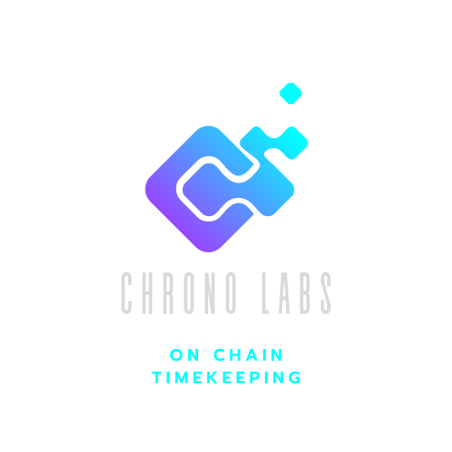

    

# ChronoLabs 
## On-chain clocking, payroll, and milestone solution for businesses built on Solana

### Summary
ChronoLabs is a solution for corporations and businesses to employ an on-chain clocking, payroll, and milestone solution as a utility structure for keeping track of employee hours, automate payroll, and activities on an immutable, permissionless ledger. This structure is meant to create value for businesses and corporations as there is no way to alter, fake, or spoof this method of record keeping.

### What is ChronoLabs

ChronoLab's operates as a Solana based dApp built for any business that uses block chain technology. Access to the site is gated by the possession of a specific NFT (Non Fungible Token). Each individual employee will hold a unique employer issued NFT and enter records and data by interacting on the web app using the NFT as the key. See our 5-step management model.

** Integrated Crypto Payments **
Being able to receive payments is an important part of most businesses and ChronoLabs will provide a way for employees to accept crypto payments from their devices where ever they are. With the ChronoLabs POS system a customer can simply scan a SolanaPay QR code to make a payment. 

